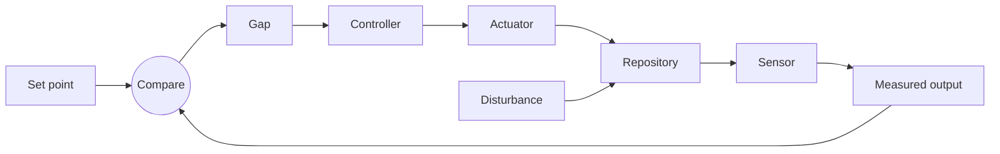

# Control loop taxonomy

Use this to explain an agent loop as a control system, so it is observable, bounded, and reviewable instead of "an agent runs sometimes." Every example is an illustration to spark discussion, not a recommendation.

## Components

- **Set point.** The desired end state for one property: an invariant ("no imports across these boundaries"), a threshold ("coverage at or above 80 percent in `core`"), or a direction ("fewer occurrences each run").
- **Sensor.** Measures the current state and the gap. Candidates: a lint or static-analysis tool, a structural search, a type checker, a test suite, an error or telemetry query, a custom script, or an agent inspecting the code. Trade-offs to discuss: repeatability, cost, and whether it can be silently disabled by a stray inline comment or config change.
- **Controller.** Turns the measurement into the next change, sized to one reviewable unit. Decides what to do now versus defer. Ranges from deterministic (sort findings, take the top N) to agentic (choose from natural-language criteria), with data-driven variants between (prioritize where production errors cluster).
- **Actuator.** The coding agent plus a repository-local skill that applies the change and opens a pull request.
- **Disturbance.** Anything changing the system outside the loop: teammates' commits, dependency updates, generated code, flaky tests, large refactors.

Components can blur. A tool that reports and ranks findings is sensor plus controller. One agent prompt that picks a target and changes it is controller plus actuator. Design the loop the user needs; do not manufacture separation.

## The signal path

## Extra parts to consider

- **Flow control.** Stop scheduled runs when an open pull request for this loop already exists.
- **Dampener.** A pull-request check that compares sensor output against a baseline so the problem cannot get worse while the loop improves it. Advisory first; block only once the team trusts the signal.
- **Scope gate.** Restrict the actuator to safe directories; exclude generated, vendored, and high-risk code unless explicitly selected.
- **Batch size.** Cap each run by finding, file, or package count.
- **Memory.** Durable reviewer feedback and known false positives, not one-off logs.

## Interview questions

1. What property are we driving, and what is the set point?
2. What in this repository can measure the gap repeatably, and what are the trade-offs of each option?
3. What counts as a gap worth acting on this run, and how big is one reviewable increment?
4. How should the controller prioritize, and how will we tune that over time?
5. Which coding agent is the actuator, what credential does it need, and what golden patterns must it follow?
6. What validation proves the actuator improved the system?
7. Which disturbances should the loop ignore, tolerate, or dampen?
8. What memory should carry between runs?
9. How do we run each component locally before it goes into CI?

## A worked shape

A loop that drives a front-end application toward zero high-impact findings from an existing code-health scanner: the scanner is both sensor and controller because it already ranks rules by impact, and the policy "fix up to five findings from the top three rules" lives in the actuator prompt. The actuator may fix, ignore with a recorded reason, or skip for a human, validating each change before a separate commit. A second workflow runs the scanner on pull requests and comments on newly introduced findings only, acting as the dampener. Every loop pull request carries one label, scheduled runs no-op while one is open, and a memory file carries standing reviewer guidance. Copy the shape, not the tool or the numbers.
